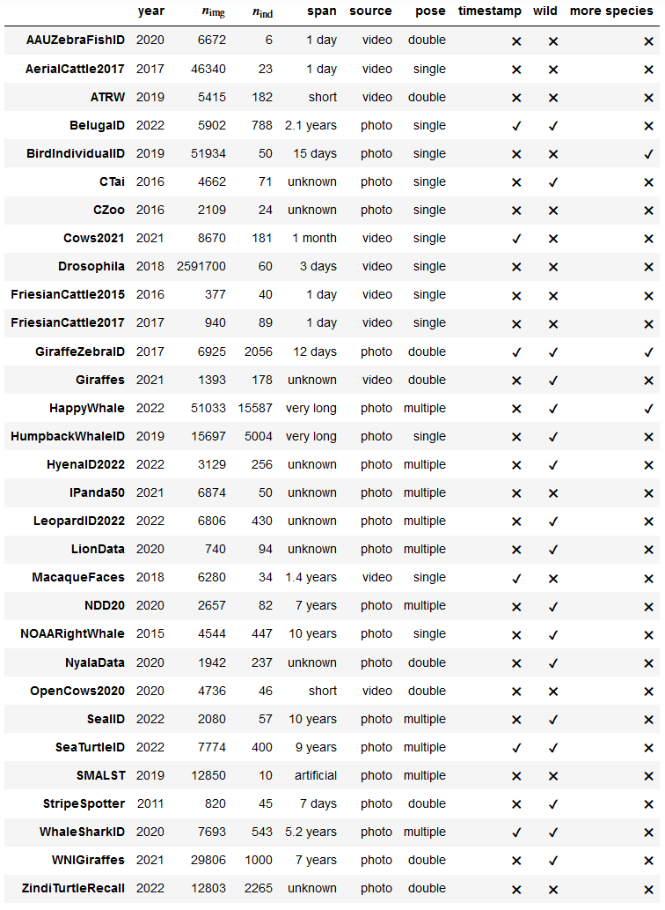
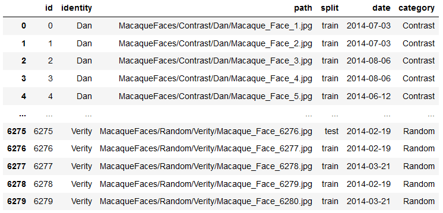
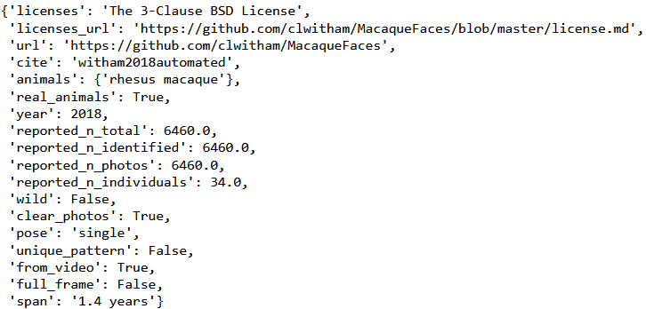

# Wildlife Re-Identification (Re-ID) Datasets

This package provides:
- overview of 30 publicly available wildlife re-identification datasets.
- utilities to mass download and convert them into a unified format.
- splits for open and closed-set classification.


## Summary of datasets

The package is able to handle the following datasets. We include basic characteristics such as publication years, number of images, number of individuals, dataset time span (difference between the last and first image taken) and whether the images were taken in the wild, whether the animals have unique patterns and whether the images are cropped.

Additional information including links to the original datasets is in a [separate Markdown file](datasets.md). Graphical summary is located in a [Jupyter notebook](notebooks/dataset_descriptions.ipynb).




## Installation

The installation is simple by
```
pip install wildlife-datasets
```


## Basic functionality

We show an example of downloading, extracting and processing the MacaqueFaces dataset.

```
from wildlife_datasets import datasets
from wildlife_datasets import utils

datasets.MacaqueFaces.download.get_data('data/MacaqueFaces')
dataset = datasets.MacaqueFaces('data/MacaqueFaces')
```

The class `dataset` contains the summary of the dataset. The content depends on the dataset. Each dataset contains the identity and paths to images. This particular dataset also contains information about the date taken and contrast. Other datasets store information about bounding boxes, segmentation masks, position from which the image was taken, keypoints or various other information such as axe or gender.

```
dataset.df
```



The dataset also contains basic metadata including information about the number of individuals, time span, licences or published year.

```
dataset.metadata
```



This particular dataset already contains cropped images of faces. Other datasets may contain uncropped images with bounding boxes or even segmentation masks.

```
utils.analysis.plot_grid(dataset.df, 'data/MacaqueFaces')
```


