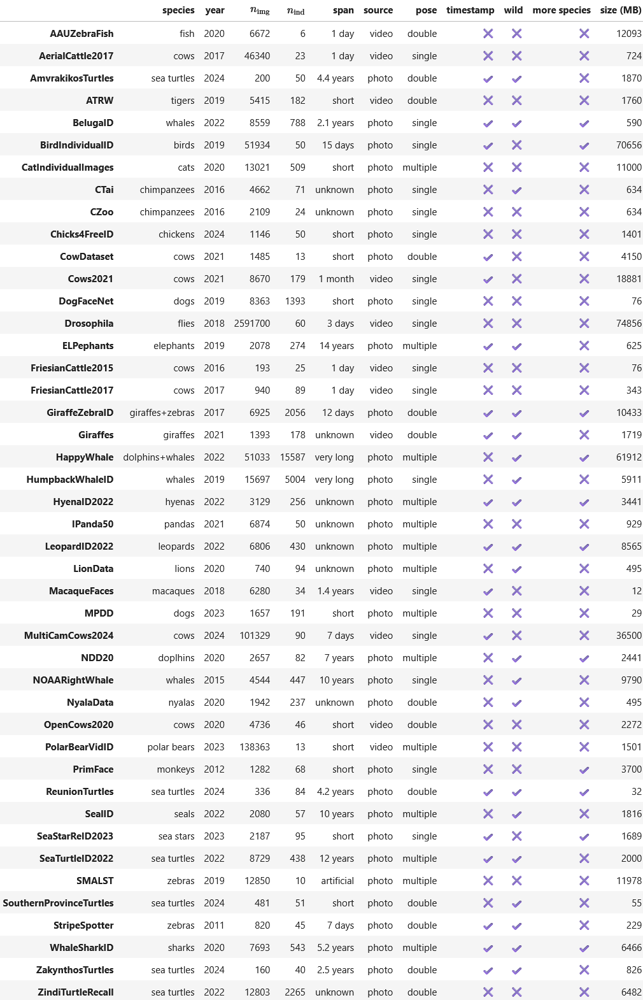

<p align="center">
  <a href="https://github.com/WildlifeDatasets/wildlife-datasets/issues"></a>
  <a href="https://github.com/WildlifeDatasets/wildlife-datasets/pulls"></a>
  <a href="https://github.com/WildlifeDatasets/wildlife-datasets/graphs/contributors"></a>
  <a href="https://github.com/WildlifeDatasets/wildlife-datasets/network/members"></a>
  <a href="https://github.com/WildlifeDatasets/wildlife-datasets/stargazers"></a>
  <a href="https://github.com/WildlifeDatasets/wildlife-datasets/watchers"></a>
  <a href="https://github.com/WildlifeDatasets/wildlife-datasets/blob/main/LICENSE"></a>
</p>

<p align="center">

</p>

<div align="center">
  <p align="center">Pipeline for wildlife re-identification including dataset zoo, training tools and trained models. Usage includes classifying new images in labelled databases and clustering individuals in unlabelled databases.</p>
  <a href="https://wildlifedatasets.github.io/wildlife-datasets/">Documentation</a>
  ·
  <a href="https://github.com/WildlifeDatasets/wildlife-datasets/issues/new?assignees=aerodynamic-sauce-pan&labels=bug&projects=&template=bug_report.md&title=%5BBUG%5D">Report Bug</a>
  ·
  <a href="https://github.com/WildlifeDatasets/wildlife-datasets/issues/new?assignees=aerodynamic-sauce-pan&labels=enhancement&projects=&template=enhancement.md&title=%5BEnhancement%5D">Request Feature</a>
</div>

</br>

| <a href="https://github.com/WildlifeDatasets/wildlife-datasets"></a>  | <a href="https://huggingface.co/BVRA/MegaDescriptor-L-384"></a> | <a href="https://github.com/WildlifeDatasets/wildlife-tools"></a> |
|:--------------:|:-----------:|:------------:|
| Datasets for identification of individual animals | Trained model for individual re&#x2011;identification  | Tools for training re&#x2011;identification models |

</br>

## Wildlife Re-Identification (Re-ID) Datasets

The aim of the project is to provide comprehensive overview of datasets for wildlife individual re-identification and an easy-to-use package for developers of machine learning methods. The core functionality includes:

- overview of 33 publicly available wildlife re-identification datasets.
- utilities to mass download and convert them into a unified format and fix some wrong labels.
- default splits for several machine learning tasks including the ability create additional splits.

An introductory example is provided in a [Jupyter notebook](notebooks/introduction.ipynb). The package provides a natural synergy with [Wildlife tools](https://github.com/WildlifeDatasets/wildlife-tools), which provides out MegaDescriptor model and tools for training neural networks.

## Summary of datasets

An overview of the provided datasets is available in the [documentation](https://wildlifedatasets.github.io/wildlife-datasets/datasets/), while the more numerical summary is located in a [Jupyter notebook](notebooks/dataset_descriptions.ipynb). Due to its size, it may be necessary to view it via [nbviewer](https://nbviewer.org/github/WildlifeDatasets/wildlife-datasets/blob/main/notebooks/dataset_descriptions.ipynb).

We include basic characteristics such as publication years, number of images, number of individuals, dataset time span (difference between the last and first image taken) and additional information such as source, number of poses, inclusion of timestamps, whether the animals were captured in the wild and whether the dataset contain multiple species.




## Installation

The installation of the package is simple by
```
pip install wildlife-datasets
```


## Basic functionality

We show an example of downloading, extracting and processing the MacaqueFaces dataset.

```
from wildlife_datasets import analysis, datasets

datasets.MacaqueFaces.get_data('data/MacaqueFaces')
dataset = datasets.MacaqueFaces('data/MacaqueFaces')
```

The class `dataset` contains the summary of the dataset. The content depends on the dataset. Each dataset contains the identity and paths to images. This particular dataset also contains information about the date taken and contrast. Other datasets store information about bounding boxes, segmentation masks, position from which the image was taken, keypoints or various other information such as age or gender.

```
dataset.df
```


The dataset also contains basic metadata including information about the number of individuals, time span, licences or published year.

```
dataset.metadata
```


This particular dataset already contains cropped images of faces. Other datasets may contain uncropped images with bounding boxes or even segmentation masks.

```
d.plot_grid()
```


## Additional functionality

For additional functionality including mass loading, datasets splitting or evaluation metrics we refer to the [documentation](https://wildlifedatasets.github.io/wildlife-datasets/) or the [notebooks](https://github.com/WildlifeDatasets/wildlife-datasets/tree/main/notebooks).

## Citation

If you like our package, please cite us.

```
@InProceedings{Cermak_2024_WACV,
    author    = {\v{C}erm\'ak, Vojt\v{e}ch and Picek, Luk\'a\v{s} and Adam, Luk\'a\v{s} and Papafitsoros, Kostas},
    title     = {{WildlifeDatasets: An Open-Source Toolkit for Animal Re-Identification}},
    booktitle = {Proceedings of the IEEE/CVF Winter Conference on Applications of Computer Vision (WACV)},
    month     = {January},
    year      = {2024},
    pages     = {5953-5963}
}
```