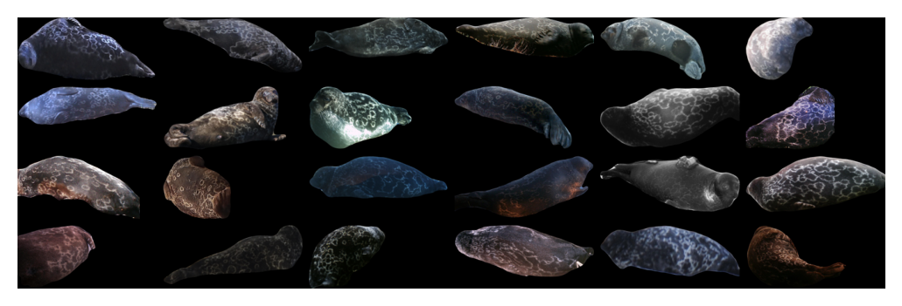

# AAUZebraFishID

# AerialCattle2017

# ATRW

# BelugaID

# BirdIndividualID

# BirdIndividualIDSegmented

# CTai

# CZoo

# Cows2021

# Drosophila

# FriesianCattle2015

# FriesianCattle2017

# GiraffeZebraID

# Giraffes

# HappyWhale

# HumpbackWhaleID

# HyenaID2022

# IPanda50

# LeopardID2022

# LionData

# MacaqueFaces

# NDD20

# NOAARightWhale

# NyalaData

# OpenCows2020

# SealID

# SealIDSegmented

# SeaTurtleID

# SeaTurtleIDHeads

# SMALST

# StripeSpotter

# WhaleSharkID

# WNIGiraffes

# ZindiTurtleRecall

